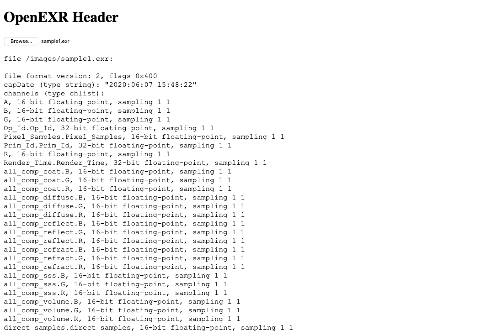

# OpenEXR - EXR Header WASM

This is an experiment in getting openexr into WASM. This ports the exr_header tool into the browser.
#

## Get Emscripten
First make sure you are setup with emscripten
https://emscripten.org

## Get the deps
Set up some environment variables and download the deps
```
export PROJECT_ROOT="$PWD"
export PROJECT_INSTALL="$PROJECT_ROOT/thirdparty"
export PROJECT_INCLUDE="$PROJECT_INSTALL/include"
export PROJECT_LIB="$PROJECT_INSTALL/lib"

./download_deps.sh
mkdir build
cd build
```

## Build ZLib
``` bash
tar -xf ../.downloads/zlib-1.2.11.tar.xz
cd zlib-1.2.11.tar.xz
mkdir build
cd build
emcmake cmake -DCMAKE_INSTALL_PREFIX="$PROJECT_INSTALL" -DBUILD_SHARED_LIBS=OFF ../
make install
cd ../../
```
## Build OpenEXR
``` bash
tar -xf ../.downloads/openexr-v2.5.1.tar.gz
cd openexr-2.5.1
mkdir build
cd build
emcmake cmake \
    -DCMAKE_INSTALL_PREFIX="$PROJECT_INSTALL" \
    -DZLIB_LIBRARY="$PROJECT_LIB" \
    -DZLIB_INCLUDE_DIR="$PROJECT_INCLUDE" \
    -DPYILMBASE_ENABLE=OFF \
    -DBUILD_TESTING=OFF \
    -DOPENEXR_BUILD_UTILS=OFF \
    -DINSTALL_OPENEXR_DOCS=OFF \
    -DINSTALL_OPENEXR_EXAMPLES=OFF \
    -DBUILD_SHARED_LIBS=0 ../
emmake make install
```

## EXR Header In the Browser
Now compile the WASM for the module.
```
em++ -g -std=c++17 -s DISABLE_EXCEPTION_CATCHING=0 -s FORCE_FILESYSTEM=1 -lidbfs.js -I$PROJECT_INCLUDE -L$PROJECT_LIB -llibIlmImf-2_5 -llibz -llibIlmThread-2_5 -llibHalf-2_5 -llibIex-2_5 exr_header.cpp --bind -o openexr.js
```

## Serve it up
I like to use the serve module from nodejs but you are can and simple server you want.
```
cd src/
serve
```

## How it works
1. First the `exr_header.cpp` very simply takes a string the a path to the exr. The browser cannot access the filesystem but emscripten gives us a VFS to work with.
2. The HTML/Javascript starts by configuring the VFS to use IndexedDB as a mounted folder.
2. The, with the created file input in the html we setup a listener that, when fired, will load the uploaded file into the indexeddb.
3. The filename is then given the WASM function and the output is then put into the div.
